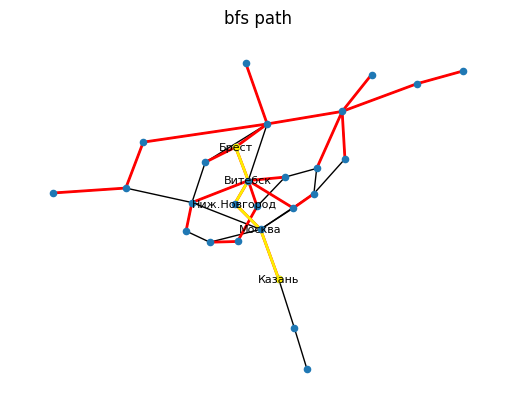

# Лабораторная работа 2 Системы искусственного интеллекта

Изучение алгоритмов поиска

# Цель задания

Исследование алгоритмов решения задач методом поиска

# Описание предметной области

Имеется транспортная сеть, связывающая города СНГ. Сеть представлена в виде таблицы связей между городами. Связи являются двусторонними, т.е. допускают движение в обоих направлениях. Необходимо проложить маршрут из одной заданной точки в другую.

# Формулировка задания

## Этап 1

### Неинформированный поиск

На этом этапе известна только топология связей между городами.

Выполнить: 

1. поиск в ширину; 
2. поиск глубину; 
3. поиск с ограничением глубины; 
4. поиск с итеративным углублением; 
5. двунаправленный поиск. 

Отобразить движение по дереву на его графе с указанием сложности каждого вида поиска. Сделать выводы.

## Этап 2

### Информированный поиск

Воспользовавшись информацией о протяженности связей от текущего узла, выполнить: 

1. жадный поиск по первому наилучшему соответствию; 
2. затем, использую информацию о расстоянии до цели по прямой от каждого узла, выполнить поиск методом минимизации суммарной оценки А*.

Отобразить на графе выбранный маршрут и сравнить его сложность с неинформированным поиском. Сделать выводы.

## Таблица связей между городами

| city1       | city2        | r    |
| ----------- | ------------ | ---- |
| Вильнюс     | Брест        | 531  |
| Витебск     | Брест        | 638  |
| Витебск     | Вильюс       | 360  |
| Воронеж     | Витебск      | 869  |
| Воронеж     | Волгоград    | 581  |
| Волгоград   | Витебск      | 1455 |
| Витебск     | Ниж.Новгород | 911  |
| Вильнюс     | Даугавпилс   | 211  |
| Калининград | Брест        | 699  |
| Калиниград  | Вильнюс      | 333  |
| Каунас      | Вильнюс      | 102  |
| Киев        | Вильнюс      | 734  |
| Киев        | Житомир      | 131  |
| Житомир     | Донецк       | 863  |
| Житомир     | Волгоград    | 1493 |
| Кишинев     | Киев         | 467  |
| Кишинев     | Донецк       | 812  |
| С.Петербург | Витебск      | 602  |
| С.Петербург | Калининград  | 739  |
| С.Петербург | Рига         | 641  |
| Москва      | Казань       | 815  |
| Москва      | Ниж.Новгород | 411  |
| Москва      | Минск        | 690  |
| Москва      | Донецк       | 1084 |
| Москва      | С.Петербург  | 664  |
| Мурманск    | С.Петербург  | 1412 |
| Мурманск    | Минск        | 2238 |
| Орел        | Витебск      | 522  |
| Орел        | Донецк       | 709  |
| Орел        | Москва       | 368  |
| Одесса      | Киев         | 487  |
| Рига        | Каунас       | 267  |
| Таллинн     | Рига         | 308  |
| Харьков     | Киев         | 471  |
| Харьков     | Симферополь  | 639  |
| Ярославль   | Воронеж      | 739  |
| Ярославль   | Минск        | 940  |
| Уфа         | Казань       | 525  |
| Уфа         | Самара       | 461  |

Задание по варианту №9 — SOURCE:"**Брест**" DESTINATION:"**Казань**"

# Ход работы

## Загружаем граф из csv
``` python
import csv  
import os  
  
import matplotlib.pyplot as plt  
import networkx as nx  
  
os.environ\["SOURCE_NODE"\] = "Брест"  
os.environ\["DESTINATION_NODE"\] = "Казань"  
  
SOURCE_NODE = os.getenv("SOURCE_NODE")  \# Брест  
DESTINATION_NODE = os.getenv("DESTINATION_NODE")  \# Казань  
  
graph_edges = list()  
with open("data.csv", "r") as dataset:  
    for line in dataset.readlines():  
        e = line.split(";")  
        graph_edges.append(\[  
            e\[0\],  
            e\[1\],  
            int(e\[2\].replace("\\n", ""))  
        \])  
print(graph_edges)  
  
G = nx.Graph()  
for e in graph_edges:  
    G.add_edge(e\[0\], e\[1\], weight=e\[2\])  
  
main\_pos = nx.spring\_layout(G, seed=17)  
from draw_graph import draw_graph as dg  
  
dg(G, main_pos, title_string="cities")
```

## Поиск в ширину
### Обход ребер
```python
bfs_edges = \[\]  
for e in nx.bfs_edges(G, source=SOURCE_NODE):  
    bfs_edges.append(e)  
    if e.\_\_contains\_\_(DESTINATION_NODE):  
        break  
print("all bfs edges:")  
for e in nx.bfs_edges(G, source=SOURCE_NODE):  
    print(e)  
print("bfs edges till DESTINATION_NODE:")  
for e in bfs_edges:  
    print(e)
```
`
all bfs edges:
('Брест', 'Вильнюс')
('Брест', 'Витебск')
('Брест', 'Калининград')
('Вильнюс', 'Даугавпилс')
('Вильнюс', 'Каунас')
('Вильнюс', 'Киев')
('Витебск', 'Воронеж')
('Витебск', 'Волгоград')
('Витебск', 'Ниж.Новгород')
('Витебск', 'С.Петербург')
('Витебск', 'Орел')
('Каунас', 'Рига')
('Киев', 'Житомир')
('Киев', 'Кишинев')
('Киев', 'Одесса')
('Киев', 'Харьков')
('Воронеж', 'Ярославль')
('Ниж.Новгород', 'Москва')
('С.Петербург', 'Мурманск')
('Орел', 'Донецк')
('Рига', 'Таллинн')
('Харьков', 'Симферополь')
('Ярославль', 'Минск')
('Москва', 'Казань')
('Казань', 'Уфа')
('Уфа', 'Самара')
bfs edges till DESTINATION_NODE:
('Брест', 'Вильнюс')
('Брест', 'Витебск')
('Брест', 'Калининград')
('Вильнюс', 'Даугавпилс')
('Вильнюс', 'Каунас')
('Вильнюс', 'Киев')
('Витебск', 'Воронеж')
('Витебск', 'Волгоград')
('Витебск', 'Ниж.Новгород')
('Витебск', 'С.Петербург')
('Витебск', 'Орел')
('Каунас', 'Рига')
('Киев', 'Житомир')
('Киев', 'Кишинев')
('Киев', 'Одесса')
('Киев', 'Харьков')
('Воронеж', 'Ярославль')
('Ниж.Новгород', 'Москва')
('С.Петербург', 'Мурманск')
('Орел', 'Донецк')
('Рига', 'Таллинн')
('Харьков', 'Симферополь')
('Ярославль', 'Минск')
('Москва', 'Казань')`
### Изображение пути на графе
```python
from find\_path\_and_draw import find\_path\_and_draw as fpd  
fpd(G, bfs\_edges, main\_pos, title_string="bfs path", print_nodes=False)
```


### Дерево
```python
from generate\_tree\_position import generate\_tree\_position as gtp  
bfs\_tree\_ = nx.bfs_tree(G, source=SOURCE_NODE)  
pos\_bfs\_tree = gtp(bfs\_tree\_)  
fpd(bfs\_tree\_, bfs\_edges, pos\_bfs_tree, title_string="bfs tree", print_nodes=False)  
\# compute complexity as b^(d+1) b - branching factor; d - minimum result depth  
from maximum\_branching\_factor import maximum\_branching\_factor as mbf  
b = mbf(bfs\_tree\_)  
d = len(nx.shortest\_path(bfs\_tree_, os.getenv("SOURCE_NODE"), os.getenv("DESTINATION_NODE")))  
print("complexity: ")  
print(b**(d+1))
```

`
complexity: 
15625
`

## Поиск в глубину
### Обход ребер
```python
dfs_edges = list()  
for e in nx.dfs_edges(G, source=SOURCE_NODE):  
    dfs_edges.append(e)  
    if e.\_\_contains\_\_(DESTINATION_NODE):  
        break  
print("all dfs edges:")  
for e in nx.dfs_edges(G, source=SOURCE_NODE):  
    print(e)
```
`
all dfs edges:
('Брест', 'Вильнюс')
('Вильнюс', 'Витебск')
('Витебск', 'Воронеж')
('Воронеж', 'Волгоград')
('Волгоград', 'Житомир')
('Житомир', 'Киев')
('Киев', 'Кишинев')
('Кишинев', 'Донецк')
('Донецк', 'Москва')
('Москва', 'Казань')
('Казань', 'Уфа')
('Уфа', 'Самара')
('Москва', 'Ниж.Новгород')
('Москва', 'Минск')
('Минск', 'Мурманск')
('Мурманск', 'С.Петербург')
('С.Петербург', 'Калининград')
('С.Петербург', 'Рига')
('Рига', 'Каунас')
('Рига', 'Таллинн')
('Минск', 'Ярославль')
('Москва', 'Орел')
('Киев', 'Одесса')
('Киев', 'Харьков')
('Харьков', 'Симферополь')
('Вильнюс', 'Даугавпилс')
`
### Изображение пути на графе
```python
from find\_path\_and_draw import find\_path\_and_draw as fpd  
fpd(G, dfs\_edges, main\_pos, title_string="dfs path")
```
`
path:
[('Брест', 'Вильнюс'),
('Вильнюс', 'Витебск'),
('Витебск', 'Воронеж'), 
('Воронеж', 'Волгоград'), 
('Волгоград', 'Житомир'), 
('Житомир', 'Киев'), 
('Киев', 'Кишинев'), 
('Кишинев', 'Донецк'), 
('Донецк', 'Москва'), 
('Москва', 'Казань')]
`

### Дерево
```python
from find\_path\_and_draw import find\_path\_and_draw as fpd  
from generate\_tree\_position import generate\_tree\_position as gtp  
dfs\_tree\_ = nx.dfs_tree(G, source=SOURCE_NODE)  
pos\_dfs\_tree = gtp(dfs\_tree\_)  
fpd(dfs\_tree\_, dfs\_edges, pos\_dfs_tree, title_string="dfs tree", print_nodes=False)  
\# compute complexity as b^m where b - branching factor; m - maximum tree depth  
  
b = mbf(dfs\_tree\_)  
m = len(nx.shortest\_path\_length(dfs\_tree\_, SOURCE_NODE))  
print("complexity:")  
print(b**m)
```

`
complexity:
18014398509481984
`
## Поиск с итеративным углублением
Проведем поиск с итеративным углублением с лимитом глубины: 1 – 13
```python
from generate\_tree\_position import generate\_tree\_position as gtp  
from find\_path\_and_draw import find\_path\_and_draw as fpd  
from draw_graph import draw_graph as dg  
for L in range(1, 14):  
    dfs\_tree\_ = nx.dfs_tree(G, source=SOURCE_NODE, depth_limit=L)  
    tree\_pos = gtp(dfs\_tree_)  
    if dfs\_tree\_.nodes.\_\_contains\_\_(DESTINATION_NODE):  
        fpd(dfs\_tree\_, list(dfs\_tree\_.edges), tree_pos, title_string="path found: dfs depth limit="+str(L),  
            mark_red=False, print_nodes=False)  
        fpd(G, list(dfs\_tree\_.edges), main_pos, title_string="path found: plain dfs depth limit="+str(L), print_nodes=False)  
        \# compute complexity as b^d where b - branching factor; d - minimum result depth  
   b = mbf(dfs\_tree\_)  
        d = L  
        print("complexity for limit=",L,":")  
        print(b**d)  
    else:  
        dg(dfs\_tree\_, tree_pos, title_string="path not found: dfs depth limit="+str(L))
```
Путь был найден для глубин со значениями: 5, 8, 9, 10, 11, 12, 13. Покажем некоторые из них:
## Глубина L=5

### Дерево

### Путь на графе

`
complexity for limit= 5 :
3125
`
## Глубина L=12

### Дерево

### Путь на графе


`
complexity for limit= 12 :
16777216
`
## Глубина L=13

### Дерево

### Путь на графе

`
complexity for limit= 13 :
67108864
`
## Двунаправленный поиск
Здесь производим двунаправленный поиск (алгоритм BFS) из `SOURCE_NODE="Витебск"` и из `DESTINATION_NODE="Казань"`. Построим деревья поиска и посчитаем сложность:
```python
L = 1  
intersection_nodes = None  
while True:  
    source\_tree = nx.bfs\_tree(G, source=SOURCE_NODE, depth_limit=L)  
    destination\_tree = nx.bfs\_tree(G, source=DESTINATION_NODE, depth_limit=L)  
    intersection_nodes = set(source_tree.nodes).intersection(set(destination_tree.nodes))  
    if intersection_nodes != set():  
        break  
   L += 1  
source\_tree\_pos = gtp(source_tree)  
destination\_tree\_pos = gtp(destination_tree)  
print("intersection:")  
print(intersection_nodes)  
for intersection_node in intersection_nodes:  
    fpd(source\_tree, source\_tree.edges, source\_tree\_pos, title_string="source tree for intersection="+str(intersection_node),  
        source_node=SOURCE_NODE,  
        destination_node=intersection_node, print_nodes=False, mark_red=False)  
    fpd(destination\_tree, destination\_tree.edges, destination\_tree\_pos, title_string="destination tree for intersection="+str(intersection_node),  
        source_node=DESTINATION_NODE,  
        destination_node=intersection_node, print_nodes=False, mark_red=False)  
    \# generate edges from nodes for draw path on plain graph source\_tree.edges+destination\_tree.destination_tree.edges  
   nx.draw\_networkx\_nodes(G, main_pos, node_size=20)  
    nx.draw\_networkx\_edges(G, main_pos, edgelist=G.edges)  
    s\_path = nx.shortest\_path(source_tree, source=SOURCE_NODE, target=intersection_node)  
    d\_path = nx.shortest\_path(destination_tree, source=DESTINATION_NODE, target=intersection_node)  
    bidirectional\_path\_edges = \[\]  
    bidirectional\_path\_labels_dict = dict()  
    for i in range(len(s_path) - 1):  
        bidirectional\_path\_edges.append((s\_path\[i\], s\_path\[i + 1\]))  
        bidirectional\_path\_labels\_dict.update({s\_path\[i\]: str(s_path\[i\])})  
        bidirectional\_path\_labels\_dict.update({s\_path\[i+1\]: str(s_path\[i+1\])})  
    for i in range(len(d_path) - 1):  
        bidirectional\_path\_edges.append((d\_path\[i\], d\_path\[i + 1\]))  
        bidirectional\_path\_labels\_dict.update({d\_path\[i\]: str(d_path\[i\])})  
        bidirectional\_path\_labels\_dict.update({d\_path\[i+1\]: str(d_path\[i+1\])})  
    nx.draw\_networkx\_edges(G, main_pos, edgelist=bidirectional\_path\_edges, edge_color='#ffee00', width=2)  
    nx.draw\_networkx\_labels(G, main_pos, labels=bidirectional\_path\_labels_dict, font_size=8)  
    plt.title("plain graph for intersection="+str(intersection_node))  
    plt.axis("off")  
    plt.show()  
    \# compute complexity as b^(d/2) b - branching factor; d - minimum result depth  
   b = max(mbf(source\_tree), mbf(destination\_tree))  
    d = len(bidirectional\_path\_edges)  
    print("complexity:")  
    print(b**(d/2))
```
Вершины получившиеся на пересечении деревьев поиска развернутых из `SOURCE_NODE`  и `DESTINATION_NODE`:
`
intersection:
{'Ниж.Новгород', 'С.Петербург', 'Орел'}
`
### Деревья поиска
Покажем деревья поиска и путь для вершины `Орел`:


### Путь на графе

`
complexity:
25.0
`
## Жадный поиск по первому нилучшему соответствию
### Функция эвристики h(n)
Будем считать функцию эвристики как расстояние по прямой между городами. Для вычисления возмем из открытых данных значение широты и долготы для городов, упомянутых в задаче. Датасет взят по ссылке: https://simplemaps.com/data/world-cities
Так как во взятых данных города написаны на латинице, а в задании используются названия на кириллице, сопоставим названия городов для выборки их из датасета:
```python
tr = dict()  
c = 0  
with open("ruseng.csv", "r") as f:  
    reader = csv.DictReader(f)  
    for row in reader:  
        tr.update({row\["eng"\]: row\["rus"\]})  
        print(row\["rus"\], row\["eng"\])  
        c+=1  
print("c=", c)  
  
my_cities = dict()  
with open("worldcities.csv", "r", newline='') as f:  
    reader = csv.DictReader(f)  
    for row in reader:  
        if tr.get(row\["city_ascii"\]) is not None:  
            my_cities.update({  
                tr.get(row\["city_ascii"\]): (row\["lat"\], row\["lng"\])  
                                            })  
print(my_cities)
```
`
Симферополь Simferopol
Волгоград Volgograd
Мурманск Murmansk
Каунас Kaunas
С.Петербург Saint Petersburg
Уфа Ufa
Таллинн Tallinn
Ниж.Новгород Nizhniy Novgorod
Самара Samara
Одесса Odessa
Ярославль Yaroslavl
Кишинев Chisinau
Вильнюс Vilnius
c= 27
{'Москва': ('46.7307', '-116.9986'), 'С.Петербург': ('59.9500', '30.3167'), 'Киев': ('50.4500', '30.5236'), 'Минск': ('53.9022', '27.5618'), 'Харьков': ('50.0000', '36.2292'), 'Ниж.Новгород': ('56.3269', '44.0075'), 'Казань': ('55.7908', '49.1144'), 'Самара': ('53.1833', '50.1167'), 'Уфа': ('54.7261', '55.9475'), 'Воронеж': ('51.6717', '39.2106'), 'Волгоград': ('48.7086', '44.5147'), 'Кишинев': ('47.0228', '28.8353'), 'Рига': ('43.0802', '-77.8753'), 'Вильнюс': ('54.6833', '25.2833'), 'Таллинн': ('59.4372', '24.7450'), 'Донецк': ('48.3369', '39.9449'), 'Ярославль': ('57.6167', '39.8500'), 'Калининград': ('54.7167', '20.5000'), 'Витебск': ('55.1833', '30.1667'), 'Симферополь': ('44.9484', '34.1000'), 'Брест': ('48.3900', '-4.4900'), 'Орел': ('52.9686', '36.0694'), 'Мурманск': ('68.9667', '33.0833'), 'Каунас': ('54.9000', '23.9333'), 'Житомир': ('50.2544', '28.6578'), 'Одесса': ('38.9988', '-93.9666'), 'Даугавпилс': ('55.8714', '26.5161')}
`
Получив данные о широте и долготе каждого города, мы можем воспользоваться формулой Хаверсина для вычисления расстояния между двумя точками на сфере по прямой: https://www.movable-type.co.uk/scripts/latlong.html
```python
import math  
def h(city):  
    R = 6371  
   target = my\_cities.get(DESTINATION\_NODE)  
    lat1 = float(target\[0\])  
    lng1 = float(target\[1\])  
    lat2 = float(my_cities.get(city)\[0\])  
    lng2 = float(my_cities.get(city)\[1\])  
    phi1 = lat1 * math.pi / 180  
   phi2 = lat2 * math.pi / 180  
   d_phi = abs(lat1 - lat2) * math.pi / 180  
   d_lambda = abs(lng1 - lng2) * math.pi / 180  
   a = math.sin(d_phi / 2)**2 \+ math.cos(phi1) * math.cos(phi2) * math.sin(d_lambda / 2)**2  
   c = 2 \* math.atan2(math.sqrt(a), math.sqrt(1 \- a))  
    d = R * c  
    return d
```
### Алгоритм поиска
Определив h(n), можем произвести поиск и посчитать его сложность:
```python
current\_node = SOURCE\_NODE  
visited = list()  
count = 0  
costs = \[\]  
max\_branch\_greedy_factor = 0  
while current\_node != DESTINATION\_NODE:  
    print(count, "*******")  
    visited.append(current_node)  
    nodes = list(nx.dfs\_preorder\_nodes(G, current_node, depth_limit=1))  
    max\_branch\_greedy_factor = max(len(nodes), max\_branch\_greedy_factor)  
    for visited_node in list(visited):  
        if nodes.\_\_contains\_\_(visited_node):  
            nodes.remove(visited_node)  
    min_node = nodes\[0\]  
    min_h = float('inf')  
    for i in range(len(nodes)):  
        print("h(",nodes\[i\],") =",h(nodes\[i\]))  
        if min_h > h(nodes\[i\]) and not visited.\_\_contains\_\_(nodes\[i\]):  
            min_node = nodes\[i\]  
            min_h = h(nodes\[i\])  
    print("min:", min_node)  
    costs.append(G.edges.get((current\_node, min\_node))\["weight"\])  
    current\_node = min\_node  
    count += 1  
   if count > 20:  
        break  
print("path:", visited)  
print("end_node:", current_node)  
print("accumulated_cost:", sum(costs))  
avg\_step\_cost = sum(costs) / len(costs)  
print("avg\_step\_cost:", avg\_step\_cost)  
print("max\_branch\_greedy_factor:", max\_branch\_greedy_factor)  
visited.append(current_node)  
print("complexity:", max\_branch\_greedy_factor**(1 \+ sum(costs) / avg\_step\_cost))
```
`
0 *******
h( Вильнюс ) = 1508.4096171148894
h( Витебск ) = 1191.918786466969
h( Калининград ) = 1804.3960823392015
min: Витебск
1 *******
h( Вильнюс ) = 1508.4096171148894
h( Воронеж ) = 795.1807597481139
h( Волгоград ) = 847.0124782845228
h( Ниж.Новгород ) = 322.53588772361303
h( С.Петербург ) = 1198.7687708776514
h( Орел ) = 899.5316852380823
min: Ниж.Новгород
2 *******
h( Москва ) = 8541.610784068394
min: Москва
3 *******
h( Казань ) = 0.0
h( Минск ) = 1389.9118226999526
h( Донецк ) = 1037.3405404052116
h( С.Петербург ) = 1198.7687708776514
h( Орел ) = 899.5316852380823
min: Казань
path: ['Брест', 'Витебск', 'Ниж.Новгород', 'Москва']
end_node: Казань
accumulated_cost: 2775
avg_step_cost: 693.75
max_branch_greedy_factor: 8
complexity: 32768.0
`
### Изображение пути на графе
```python
greedy_edges = \[\]  
for i in range(len(visited) - 1):  
    greedy_edges.append((visited\[i\], visited\[i+1\]))  
nx.draw\_networkx\_nodes(G, main_pos, G.nodes, node_size=20)  
nx.draw\_networkx\_edges(G, main_pos, G.edges, width=1)  
nx.draw\_networkx\_edges(G, main\_pos, greedy\_edges, edge_color='#ffee00', width=2)  
visited\_greedy\_labels_dict = dict()  
for node in visited:  
    visited\_greedy\_labels_dict.update({  
        node: str(node)  
    })  
nx.draw\_networkx\_labels(G, main\_pos, visited\_greedy\_labels\_dict, font_size=8)  
plt.title("greedy search")  
plt.axis("off")  
plt.show()
```

## Алгоритм минимизации функции эвристики A*
### Реализация и сложность
Имея данные о расстоянии между городами как веса ребер графа из задания и определенной выше функции эвристики выше можем провести поиск с помощью алгоритма A*, также вычислим по ходу сложность:
```python
def astar_heuristic (a, b):  
    return h(a)  
astar\_p = nx.astar\_path(G, source=SOURCE_NODE, target=DESTINATION_NODE, heuristic=astar_heuristic)  
astar\_cost = nx.astar\_path_length(G, source=SOURCE_NODE, target=DESTINATION_NODE, heuristic=astar_heuristic)  
print("path:", astar_p)  
print("cost: ", astar_cost)  
\# compute branch factor & average\_step\_cost & make edges from path  
astar_edges = \[\]  
astar\_branch\_factor = 0  
astar_costs = \[\]  
for i in range(len(astar_p) - 1):  
    astar\_edges.append((astar\_p\[i\], astar_p\[i + 1\]))  
    astar\_branch\_factor = max(astar\_branch\_factor, len(list(nx.dfs\_preorder\_nodes(G, astar_p\[i\], depth_limit=1))))  
    astar\_costs.append(G.edges.get((astar\_p\[i\], astar_p\[i + 1\]))\["weight"\])  
print("astar\_branch\_factor:", astar\_branch\_factor)  
astar\_avg\_step_cost = sum(astar_costs) / len(astar_costs)  
print("complexity:", astar\_branch\_factor**(1 \+ astar\_cost / astar\_avg\_step\_cost))  
  
nx.draw\_networkx\_nodes(G, main_pos, node_size=20)  
nx.draw\_networkx\_edges(G, main_pos, width=1)  
nx.draw\_networkx\_edges(G, main_pos, edgelist=astar_edges, width=2, edge_color="yellow")  
astar\_labels\_dict = dict()  
for node in astar_p:  
    astar\_labels\_dict.update({  
        node: str(node)  
    })  
nx.draw\_networkx\_labels(G, main_pos, labels=astar\_labels\_dict, font_size=8)  
plt.title("a-star")  
plt.axis("off")  
plt.show()
```
`
path: ['Брест', 'Витебск', 'Орел', 'Москва', 'Казань']
cost:  2343
astar_branch_factor: 8
complexity: 32768.0
`
### Изображение пути на графе

# Сравнительная таблица результатов  
| Алгоритм | Вычисленная сложность |  
|---------|-----------------------|  
|BFS   | 15625                 |  
|DFS   | 18014398509482000     |  
|DFS L = 5 | 3125                  |  
|DFS L = 8|    65536                |  
|DFS L = 10|   9765625              |  
|DFS L = 11|   48828125             |  
|DFS L = 12|   16777216             |  
|DFS L = 13|   67108864|  
|Bi-Directional|   25|  
|Greedy|   32768|  
|A-Star|   32768|
# Вывод
Сравнение показывает, что на данном графе лучше всего себя показал алгоритм двунаправленного поиска. Оценка алгоритмов информированного поиска показали одинаковый результат, порядок сопоставим с алгоритмом поиска в ширину. Также можем видеть как деградирует алгорим с итеративным углублением при увеличении лимита прыжков, хотя при наименьшем лимите порядок вычисленной сложности даже меньше чем у алгоритмов информированного поиска.
# Ссылки
1. Датасет городов мира // simplemaps.com: https://simplemaps.com/data/world-cities
2. Формула расстояния между точками на сфере (формула Хаверсина) // Movable Type Scripts: https://www.movable-type.co.uk/scripts/latlong.html
3. Библиотека NetworkX // https://networkx.org/
4. Генерация положения вершин для дерева // NetworkX Gallery: https://networkx.org/documentation/stable/auto_examples/graph/plot_morse_trie.html